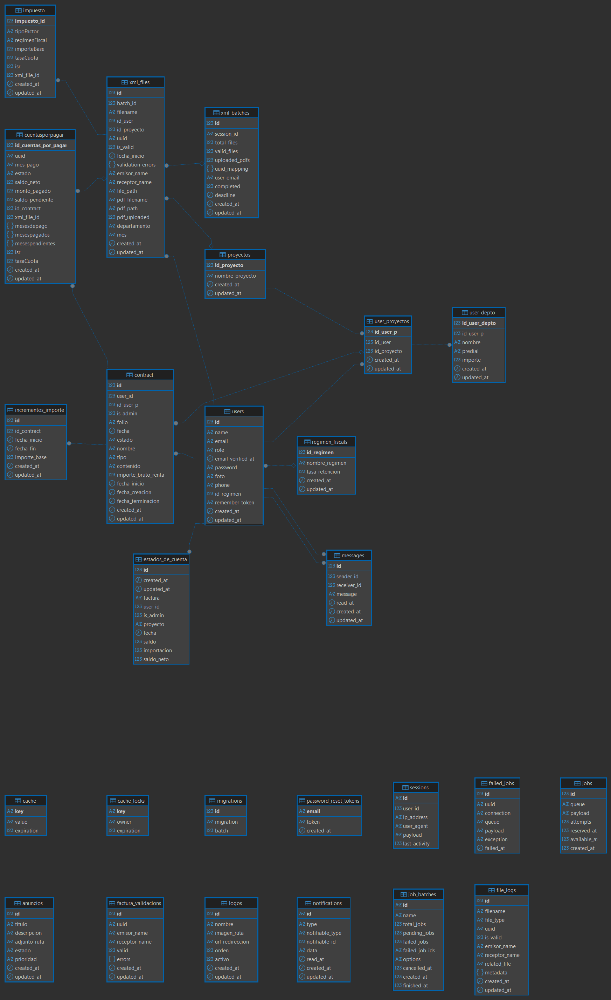
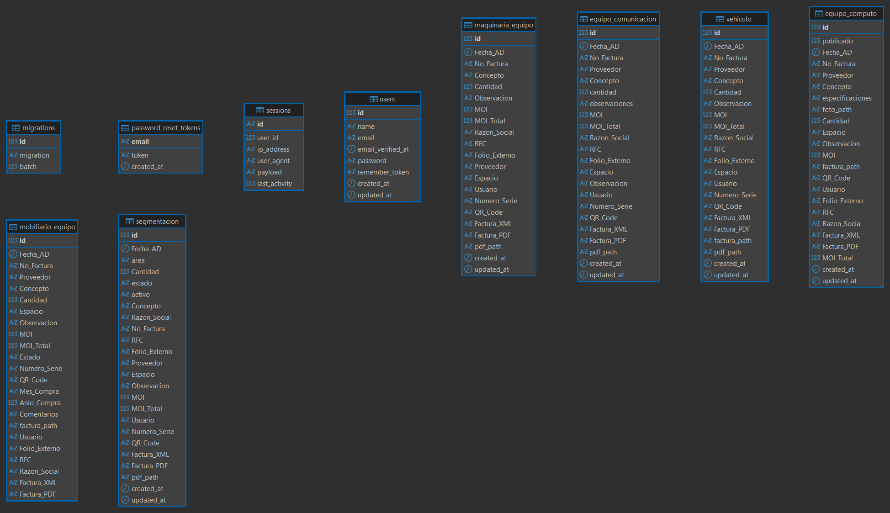

# Revisiónes

## Observaciones

### Lentitud de carga

Se detectó el uso de tiempos estáticos (setTimeout) de 620ms (ejecutados doblemente, sumando ~1.3s) para manejar la visibilidad de elementos.

- Problema: El tiempo de espera es arbitrario. Si el servidor responde rápido, el usuario espera innecesariamente; si el servidor tarda más, la animación falla.
- Solución Propuesta: Utilizar **Promesas** o **async/await** para sincronizar las animaciones con la carga real de los datos.
- Si no hay una carga de datos pesada, se recomienda omitir la animación para mejorar la percepción de velocidad (Performance).

### Contraseña

Actualmente, si la contraseña no cumple con la longitud requerida, el sistema recarga la página sin mostrar un mensaje de error ("Silent Fail").

- Problema: El usuario no sabe por qué falló el proceso, lo que genera frustración y abandono.

- Solución Propuesta: * Implementar validación en el cliente (JavaScript/HTML5) para feedback inmediato.

- Asegurar que el Backend retorne los errores de validación y estos se muestren en la vista.

### Configuración de Caché

Para optimizar el rendimiento y la persistencia de las sesiones/consultas, es necesario migrar el manejador de caché a la base de datos.

- Acción Requerida: Ejecutar los siguientes comandos para crear la estructura necesaria:

```Bash
php artisan cache:table
php artisan migrate
```

## Base de datos

### Normalización y Relaciones

Se observa una falta de integridad referencial y redundancia de datos en la tabla actual de inventario. Existen campos repetidos que deberían obtenerse mediante relaciones.

- Observación: Se debe vincular la tabla de inventario con la tabla de usuarios mediante una Foreign Key (FK).

- Riesgo: La duplicidad de campos causará inconsistencias de datos y dificultades en el mantenimiento a largo plazo.

- Se puede hacer relacion al usuario, verificar bien eso hay muchos campos repetido a la larga esto causara problemas.  
Ejemplo de abajo:
  
Esta es la suya:  

